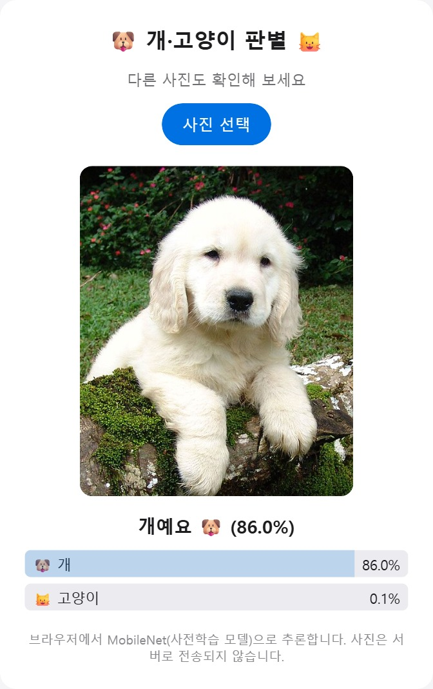

# 개·고양이 판별 서비스

브라우저에서 이미지를 선택하면 개인지 고양이인지 판별합니다. 사전학습된
MobileNet(TensorFlow.js) 모델을 그대로 사용하며, 사진은 서버로 전송되지 않고
브라우저 안에서만 처리됩니다.

예시 사진: 골든 리트리버 (퍼블릭 도메인, Wikimedia Commons)

## 실행

정적 파일이라 빌드가 필요 없습니다.

    npx serve .

또는 `index.html`을 브라우저에서 바로 엽니다. 모델 가중치는 최초 1회
인터넷에서 내려받습니다(약 15MB).

## 판별 방식

MobileNet은 ImageNet 1000개 클래스를 예측합니다.

- 개: 클래스 인덱스 151–268 (개 품종)
- 고양이: 클래스 인덱스 281–285 (tabby, tiger cat, Persian, Siamese, Egyptian)

두 구간의 확률 합을 비교해 더 큰 쪽으로 판별하고, 둘 다 20% 미만이면
"판별 불가"로 표시합니다.

## 파일

- `index.html` — UI
- `app.js` — 모델 로딩 및 추론
- `style.css` — 스타일
